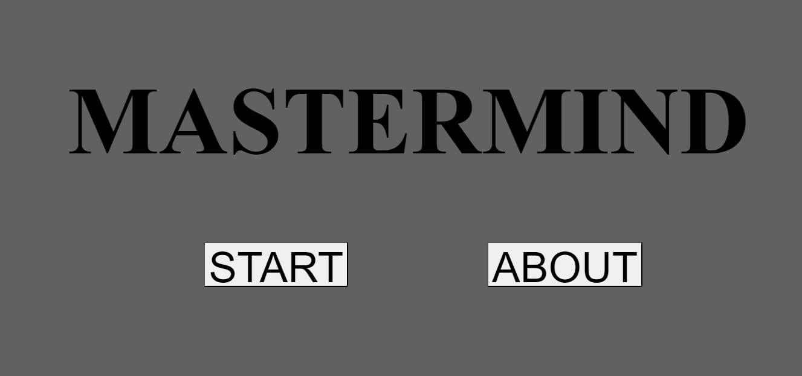
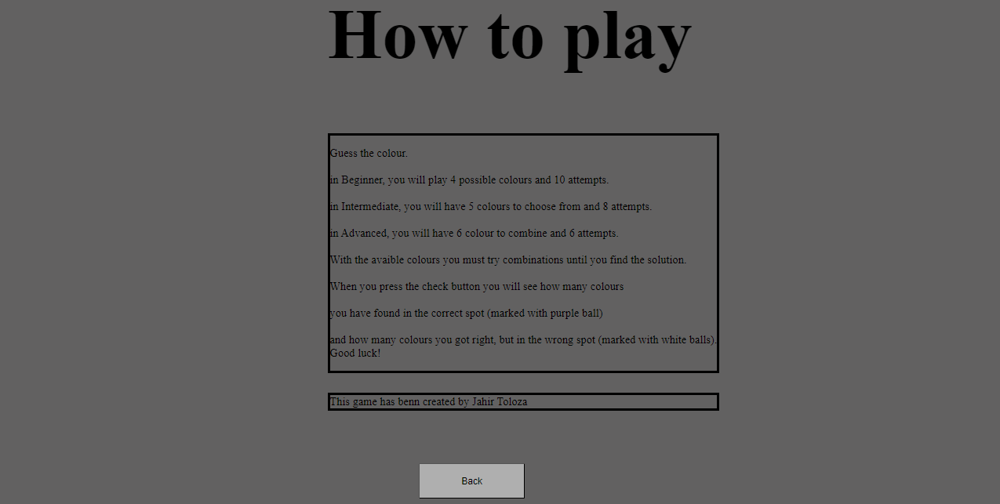
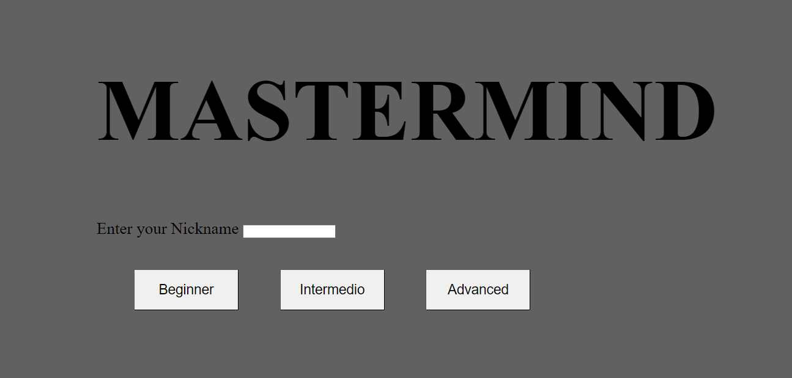
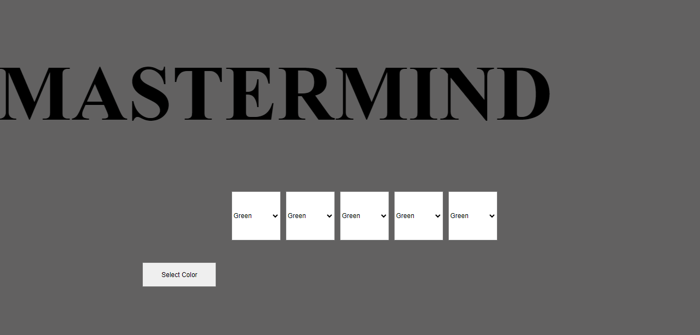
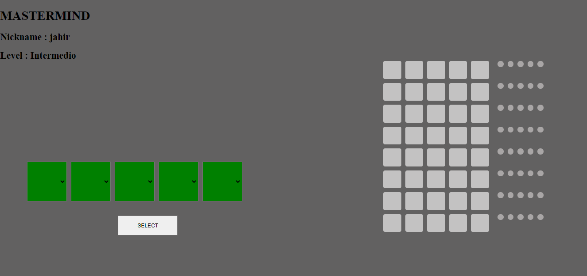

# PROYECTO 3 MASTERMIND 🎮

EL objetivo de este proyecto es implemetar una aplicacion llamada MASTERMIND que nos permita jugar en un table con fichas blancas, negras pequeñas y una con colores interactivas. 
en el juego original, un jugador escoge un numero de fichas de colores, 4 om as, introduce un codigo secreto seria la combinacion de colores oculto al otro jugador, el jugador toma las fichas de colores del mismo, pone una combinacion contestada con moradas (fichas de color bien colocadas) o blancas (fichas en el color correcto, pero mal posicionadas en el orden de combinacion).
El juego termina con una victoria al averiguar la combinación (es decir, se consigue
una combinación con cuatro bolas moradas), o bien se agota el tablero y somos
derrotados (depende del tamaño, aunque generalmente son 10 intentos de
combinaciones).

## Tabla de Contenidos 🗒️
- [Tecnologias](#capturas-de-pantalla)
- [Capturas de Pantalla](#capturas-de-pantalla)
- [Instalación](#instalación)
- [Uso](#uso)
- [Desarrollo Local](#desarrollo-local)
- [Licencia](#licencia)


## Tecnologias 💻


1. HTML: Para la estructura y contenido de tu página web.

2. CSS: Para el diseño y estilo de tus elementos HTML.

3. JavaScript (Vanilla): Para la interactividad de la consola Game Boy. Has utilizado JavaScript para manipular el DOM (Document Object Model), Nomenclatura ES6 y gestionar eventos como clics utilizando API session storage para guarda y almacenar informacion.

4. GitHub: Para alojar y versionar .


## Capturas de Pantalla 📸
Inicio

About

Nickname

Seleccionar color

Juego


## Instalación ⚙️
No se requiere una instalación especial para utilizar el juego MASTERMIND en tu sitio web. Solo necesitas incluir los archivos JavaScript, HTML y CSS en tu proyecto.


## Uso 📌
Para utilizar la consola MASTERMIND, simplemente incorpora el componente principal  en tu archivo HTML. Además, puedes agregar otros componentes específicos según tus necesidades.


## Desarrollo Local 🔨
Si deseas contribuir o realizar modificaciones locales al proyecto, sigue estos pasos:
1. Clona este repositorio:
```
  git clone https://github.com/Jahirtoloza14/Proyecto3.git
```
2.Abre el proyecto en tu editor de código favorito.
3.Realiza las modificaciones o contribuciones deseadas en los archivos .js y .css. 
4. Para ver tus cambios localmente, simplemente abre el archivo HTML en un navegador.
## Licencia 💳

Este proyecto está bajo la licencia MIT.


